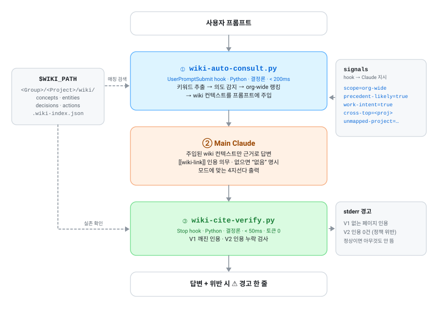
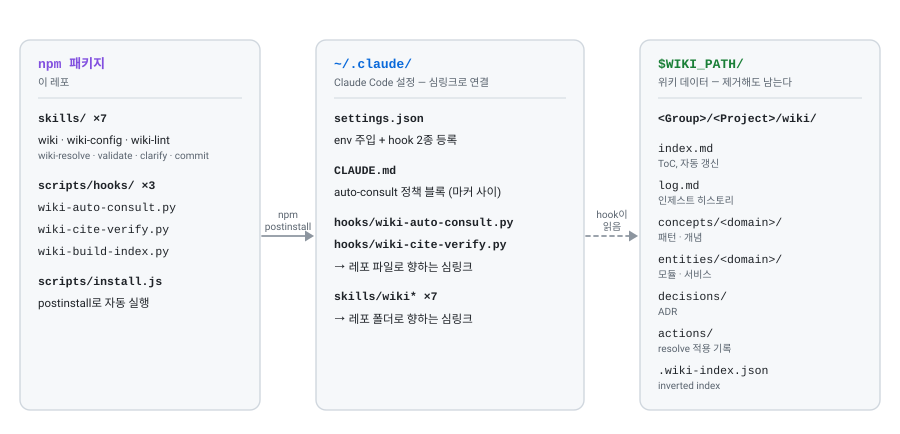
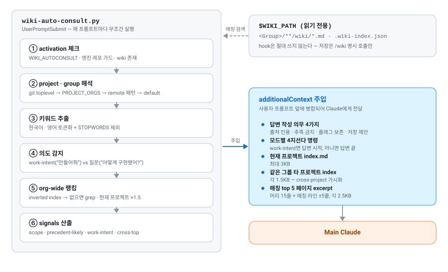
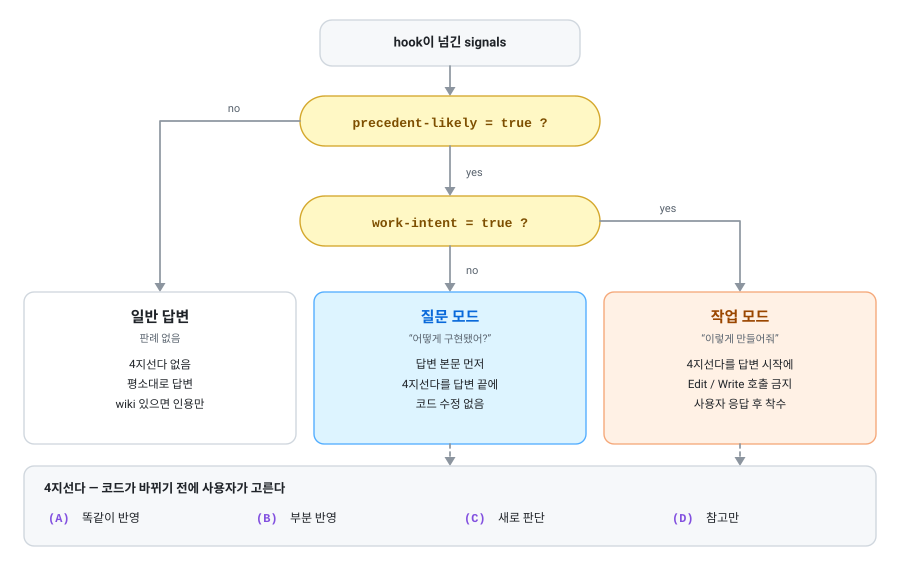
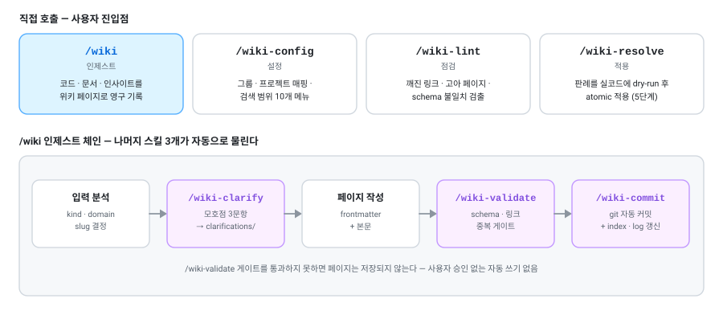

<h1 align="center">Wiki</h1>

<p align="center">
  <b>LLM Wiki for Claude Code</b> — Andrej Karpathy의 <i>LLM Wiki</i> 컨셉을<br>
  Claude Code 환경에 결정론적으로 구현한 에이전트
</p>

<p align="center">
  Claude가 <b>매 프롬프트마다</b> 프로젝트 위키를 자동으로 읽고,<br>
  답변에 <code>[[wiki-link]]</code> 인용을 남겼는지 <b>hook이 매번 검사</b>합니다.<br>
  LLM을 한 번도 더 호출하지 않는 Python 결정론 레이어 — 벡터 DB도, 추가 API 키도 없습니다.
</p>

<p align="center">
  <picture>
    <source media="(prefers-color-scheme: dark)" srcset="docs/assets/pipeline-dark.svg">
    
  </picture>
</p>

---

## 목차

- [무엇인가](#무엇인가)
- [Tech Stacks](#tech-stacks)
- [핵심 컨셉](#핵심-컨셉)
- [아키텍처 한눈에](#아키텍처-한눈에)
- [설치](#설치)
- [첫 설정 (Onboarding)](#첫-설정-onboarding)
- [디렉토리 구조](#디렉토리-구조)
- [핵심 기능 — 자동 위키 참조 (Auto-Consult)](#핵심-기능--자동-위키-참조-auto-consult)
- [인용 검증 layer (cite-verify)](#인용-검증-layer-cite-verify)
- [7가지 슬래시 스킬](#7가지-슬래시-스킬)
- [사용 시나리오](#사용-시나리오)
- [설정 관리 (3가지 방법)](#설정-관리-3가지-방법)
- [Org / Project 2단계 모델](#org--project-2단계-모델)
- [Wiki 페이지 schema](#wiki-페이지-schema)
- [환경변수 레퍼런스](#환경변수-레퍼런스)
- [트러블슈팅](#트러블슈팅)
- [제거](#제거)

---

## 무엇인가

LLM과 일하면서 마주치는 두 가지 만성 문제를 해결합니다:

1. **환각(hallucination)** — Claude가 모르는 걸 모른다고 안 하고 그럴듯하게 만들어냄
2. **휘발성** — 어렵게 합성한 답이 대화창 닫으면 사라짐. 다음에 같은 질문 또 함

이 도구는:

- 프로젝트별 마크다운 위키를 만들어 두고
- Claude가 답할 때 자동으로 그 위키를 참조하게 하고
- 위키에 없는 새 인사이트는 사용자 승인 후 영구 저장하게 합니다

결과: **시간이 갈수록 위키가 풍성해지고, 같은 질문 반복이 줄고, 답변 신뢰도가 올라감.**

---

## Tech Stacks

#### Platform


#### Runtime

&nbsp;


#### Storage

&nbsp;


#### Cost


<br/>

---

## 핵심 컨셉

### Karpathy LLM Wiki 정신

Andrej Karpathy가 X에 제안한 "LLM Wiki" 컨셉의 핵심:

| 원칙               | 의미                                                   |
| ------------------ | ------------------------------------------------------ |
| 출처 귀속          | 모든 주장이 wiki 페이지에 근거. 환각 차단              |
| 구조화된 지식      | concept / entity / decision 분류 + 일관 schema         |
| Human-in-the-Loop  | LLM 제안 → 사람 승인 → 저장 (자동 쓰기 금지)           |
| 점진적 누적        | 일상 대화에서 가치 있는 인사이트 자동 추출 → wiki 진화 |
| 양방향 링크        | `[[wiki-link]]` 기반 그래프                            |
| Discoverability    | index, 도메인 분류, 빠른 탐색                          |
| Anti-hallucination | "wiki에 없으면 없다고 명시" 의무                       |

### 이 구현이 더한 것

Karpathy 원안 + 다음을 추가:

1. **결정론적 자동 발화** — Python `UserPromptSubmit` hook이 매 프롬프트마다 wiki 검색·주입
2. **Org / Project 2단계** — 회사·팀·프로젝트군 단위로 wiki 격리, 같은 그룹 내 cross-project 검색
3. **작업 모드 vs 질문 모드 분기** — "어떻게 만들어줘"는 코드 작성 전 4지선다, "어떻게 구현됐어?"는 답변 끝 4지선다
4. **5단계 적용 엔진** — `/wiki-resolve`로 판례를 실 코드에 dry-run 후 atomic 적용
5. **인용 검증 layer** — Python `Stop` hook이 매 답변 후 `[[wiki-link]]` 실존·인용 누락 여부 결정론 검사 (V1+V2)

### 설계 결정

- **결정론 우선**: Python hook (Claude Code의 `UserPromptSubmit`)으로 wiki 주입을 강제. Claude의 변덕에 의존하지 않음
- **무료**: 추가 LLM 호출·API 키·subscription 없음. Claude Code 구독료 외 비용 0
- **로컬 파일 기반**: 마크다운 + JSON 인덱스. 외부 DB·임베딩·벡터 스토어 없음 (Karpathy 정신 준수)

---

## 아키텍처 한눈에

요청 한 번이 처리되는 동안 두 개의 Python hook이 Claude의 앞뒤를 감쌉니다.
앞의 hook은 위키를 **주입**하고, 뒤의 hook은 인용을 **검사**합니다.
둘 다 LLM을 호출하지 않으므로 토큰 비용이 붙지 않습니다 (맨 위 다이어그램).

| 단계 | 역할 | 비용 | 조건 불충족 시 |
| --- | --- | --- | --- |
| ① `wiki-auto-consult.py` | `UserPromptSubmit` hook — 위키 검색 후 컨텍스트 주입 | < 200ms · 토큰 0 | 조용히 skip, 평소대로 답변 |
| ② Main Claude | 주입된 컨텍스트 + `CLAUDE.md` 정책으로 답변 | 일반 대화와 동일 | — |
| ③ `wiki-cite-verify.py` | `Stop` hook — 인용 실존·누락 검사 | < 50ms · 토큰 0 | stderr 경고 한 줄 |
| 슬래시 스킬 7종 | `/wiki`, `/wiki-config`, `/wiki-lint`, `/wiki-resolve` 등 | 명시 호출 시에만 | — |

### 설치 후 무엇이 어디에 놓이나

엔진(심링크)과 데이터(`$WIKI_PATH`)를 분리했습니다. 패키지를 지워도 위키는 그대로 남습니다.

<picture>
  <source media="(prefers-color-scheme: dark)" srcset="docs/assets/layout-dark.svg">
  
</picture>

---

## 설치

### 사전 요구사항

- **Node.js** ≥ 18
- **Python 3** (macOS·Linux 기본 포함)
- **Claude Code** CLI 설치 + 로그인 완료
- **git** (프로젝트 감지용)

### 설치 명령

```bash
git clone https://github.com/HunKim-Dev/Wiki.git
cd Wiki
npm install -g .
```

> npm 레지스트리에는 배포하지 않았습니다. 위 clone 방식이 유일한 설치 경로입니다.
> (`npm install -g wiki-agent`는 **다른 사람의 무관한 패키지**이니 실행하지 마세요.)

`postinstall`이 자동으로 실행됩니다:

- 위키 저장 폴더 지정 (사용자 입력, 기본 제안 `~/wiki-docs`)
- 그룹 이름 입력 (사용자 입력, git remote에서 추측 제안)
- 프로젝트→그룹 매핑 (선택)
- 7개 스킬 → `~/.claude/skills/` 심링크
- hook 2종 → `~/.claude/hooks/` 심링크 + `settings.json` 등록
- auto-consult 정책 블록을 `~/.claude/CLAUDE.md`에 주입

하드코딩된 조직 목록이나 고정 경로는 없습니다. 전부 설치 시 지정하고, 이후 `/wiki-config`로 바꿉니다.

수동 재설치 필요시:

```bash
npm run install:manual
```

---

## 첫 설정 (Onboarding)

설치 중 인터랙티브 프롬프트:

### Step 1 — 위키를 저장할 폴더 지정

기존 폴더가 있으면 자동 감지해 제안하고, 없으면 `~/wiki-docs`를 제안합니다.
Enter로 제안을 받거나, 원하는 경로를 직접 입력하면 됩니다 (`~` 사용 가능).

```
  [WIKI_PATH] 위키 마크다운을 저장할 폴더를 지정하세요.
  소스 레포와 분리된 곳을 권장합니다 — 패키지를 지워도 위키는 남습니다.
  저장 폴더 [~/wiki-docs]: ⏎
  → 새로 생성: ~/wiki-docs
```

자동 감지 후보 (우선순위 순): `~/wiki-docs`, `~/WorkSpace/wiki-docs`, `~/Documents/wiki-docs`,
`~/Projects/wiki-docs`, `~/Code/wiki-docs`, `~/Dev/wiki-docs`, `~/wiki-data`

### Step 2 — 그룹 이름 입력

그룹은 위키를 나누는 단위입니다. 회사·팀·클라이언트·개인 등 **무엇이든 됩니다** —
정해진 목록은 없고, 입력한 이름이 그대로 폴더 이름이 됩니다.

```
  [WIKI_ORGS] 위키를 나눌 "그룹" 이름을 직접 입력하세요.
  회사·팀·클라이언트·개인 등 프로젝트를 묶는 단위면 무엇이든 됩니다.
  그룹은 그대로 폴더 이름이 됩니다 — <저장 폴더>/<그룹>/<프로젝트>/wiki/

  그룹 이름 (쉼표 구분) [git remote에서 감지: acme]: Acme,Contoso
  → 그룹: Acme, Contoso
  기본 그룹 [Acme]: ⏎
```

Enter만 치면 설치를 실행한 폴더의 git remote에서 org를 추측해 씁니다
(`github.com/acme/repo` → `acme`). remote가 없으면 `Personal` 하나로 시작합니다.
그룹은 언제든 `/wiki-config`로 추가·제거할 수 있습니다.

> 이름은 그대로 디렉토리가 되므로 `/`, `\`, `..`가 들어간 입력은 거부됩니다.

### Step 3 — 프로젝트 매핑 (선택)

그룹이 2개 이상일 때만 물어봅니다. 비워도 되고, 이후 `/wiki-config`에서 추가할 수 있습니다.

```
  [WIKI_PROJECT_ORGS] (선택) 자주 쓰는 프로젝트를 그룹에 매핑해두면 hook이 자동 감지:
  입력 형식: "project1=group1,project2=group2" (Enter로 건너뛰고 나중에 지정 가능)
  예: web-front=Acme,api-server=Contoso

  매핑 입력 (비우면 나중에 자동 감지/수동): ⏎
  → 매핑 비움. /wiki 첫 실행 시 자동 또는 수동 매핑.
```

### Step 4 — 설치 완료 안내

```
[wiki] 설치 완료.

  WIKI_PATH         = ~/wiki-docs
  WIKI_ORGS         = Acme,Contoso
  WIKI_DEFAULT_ORG  = Acme
  WIKI_PROJECT_ORGS =

사용:
  cd <소스 레포> && claude
  (그냥 기술 질문) — Hook이 결정론적으로 wiki 참조 답변 형성·주입
  /wiki <파일>     — 인제스트 + 검증 게이트 + 자동 커밋
  /wiki-lint       — 독립 점검
  /wiki-resolve    — 판례 기반 실 파일 수정
```

### 비대화형 설치 (CI·자동화)

TTY가 없으면 **질문 없이** 기본값으로 끝냅니다. 설치가 멈추는 일은 없습니다.

```
[wiki] 비대화형 — WIKI_PATH 기본값 사용: ~/wiki-docs
[wiki] 비대화형 — WIKI_ORGS 기본값 사용: Personal
[wiki] 비대화형 — project→그룹 매핑 건너뜀 (/wiki-config로 추가)
```

나중에 `/wiki-config`로 바꾸거나, TTY에서 `npm run install:manual`을 다시 실행하면 됩니다.

---

## 디렉토리 구조

설치 후 만들어지는 파일들:

### `~/.claude/` (Claude Code 설정)

```
~/.claude/
├── settings.json                    ← env + UserPromptSubmit + Stop 등록
├── CLAUDE.md                         ← auto-consult 정책 블록 주입됨
├── hooks/
│   ├── wiki-auto-consult.py        ← UserPromptSubmit 심링크
│   └── wiki-cite-verify.py         ← Stop 심링크 (인용 검증)
└── skills/
    ├── wiki/                         ← 심링크
    ├── wiki-clarify/
    ├── wiki-commit/
    ├── wiki-config/
    ├── wiki-lint/
    ├── wiki-resolve/
    └── wiki-validate/
```

### `$WIKI_PATH/` (위키 데이터)

```
$WIKI_PATH/                          ← 예: ~/WorkSpace/wiki-docs/
└── <Group>/                         ← 예: Acme/
    └── <Project>/                   ← 예: admin-front/
        └── wiki/
            ├── index.md             ← ToC, 자동 갱신
            ├── log.md               ← 인제스트 히스토리
            ├── concepts/            ← 패턴·개념 페이지
            │   ├── auth/...
            │   ├── ui/...
            │   └── scroll/...
            ├── entities/            ← 모듈·서비스·컴포넌트
            ├── decisions/           ← ADR (Architecture Decision Record)
            ├── actions/             ← /wiki-resolve 적용 기록
            ├── lint-reports/        ← /wiki-lint 결과
            ├── clarifications/      ← /wiki-clarify Q&A 저장
            └── .wiki-index.json    ← inverted index (선택, 100+ 페이지에서 권장)
```

---

## 핵심 기능 — 자동 위키 참조 (Auto-Consult)

매 사용자 프롬프트마다 자동 발화하는 Python hook이 핵심.

### 동작 흐름

hook은 activation 체크부터 signals 산출까지 6단계를 거친 뒤, 결과를 `additionalContext`로 사용자 프롬프트 앞에 병합합니다.
위키는 **읽기만** 합니다 — hook이 페이지를 새로 쓰는 일은 없습니다.

<picture>
  <source media="(prefers-color-scheme: dark)" srcset="docs/assets/auto-consult-dark.svg">
  
</picture>

### 시그널별 동작

| 시그널                  | 의미                              | Main Claude 행동                            |
| ----------------------- | --------------------------------- | ------------------------------------------- |
| `precedent-likely=true` | 매칭 페이지에 결정·구현 패턴 있음 | 4지선다 출력                                |
| `work-intent=true`      | 사용자 "만들어줘" 의도            | 4지선다를 답변 **시작**에 (코드 작성 전)    |
| (work-intent 없음)      | 질문 모드                         | 4지선다를 답변 **끝**에                     |
| `cross-top=<X>`         | 다른 그룹 프로젝트 매칭           | "현재 프로젝트엔 없어 X에서 참조" 명시      |
| `unmapped-project=X:Y`  | 기본 그룹 폴백                    | settings.json `WIKI_PROJECT_ORGS` 추가 권유 |

### 모드 분기 — 4지선다는 언제, 어디에 뜨나

`precedent-likely`와 `work-intent` 두 시그널의 조합이 답변 형태를 결정합니다.
핵심은 **작업 모드**입니다. 위키에 판례가 있는데 사용자가 코드를 요청하면,
Claude는 `Edit`/`Write`를 호출하기 **전에** 4지선다를 띄우고 멈춥니다.

<picture>
  <source media="(prefers-color-scheme: dark)" srcset="docs/assets/mode-branch-dark.svg">
  
</picture>

### 비활성화

```bash
# 영구 (설정 파일)
/wiki-config → 9. 자동 위키 참조 켜기/끄기

# 임시 (현재 셸 세션만)
export WIKI_AUTOCONSULT=0

# 다시 활성
unset WIKI_AUTOCONSULT
```

---

## 인용 검증 layer (cite-verify)

매 답변 후 결정론적으로 인용 정책 위반 검사. **Python 결정론, LLM 호출·토큰 비용 0**.

### 무엇을 검사하나

| 검증 | 위반 조건 | 의미 |
|---|---|---|
| **V1 — 깨진 인용** | 답변의 `[[wiki-link]]`가 실존 wiki 파일을 가리키지 않음 | Claude가 환각으로 없는 페이지 인용 |
| **V2 — 인용 누락** | wiki 컨텍스트 받았는데(`event=injected, matched_count > 0`) 답변에 `[[ ]]` 0건 | 출처 귀속 정책 위반 (anti-hallucination 직격) |

### 동작 흐름

```
사용자 prompt
   ↓
[wiki-auto-consult] wiki 컨텍스트 주입 (기존)
   ↓
Claude 답변
   ↓
[wiki-cite-verify] (Stop hook, ~50ms)
   ├─ transcript 마지막 assistant 메시지 추출
   ├─ 답변 < 100자 = 잡담, skip
   ├─ [[ ]] 정규식 추출
   ├─ 인용 0건 + wiki context 받음 → V2 위반
   ├─ 인용 있음 → 각각 file exist 확인 → 깨진 거 있으면 V1 위반
   └─ 위반 발견 시 stderr로 한 줄 출력
```

### 사용자 화면 예시

위반 없을 때 (대부분의 경우):
```
(아무것도 안 보임 — 정상)
```

V1 위반:
```
⚠️ wiki: 깨진 인용 1건 — [[concepts/auth/jwt-rs256]]
```

V2 위반:
```
⚠️ wiki: wiki 컨텍스트 받았는데 [[wiki-link]] 인용 0건 — 정책 위반
```

### 위반 발견 시 사용자 행동

1. **Claude 잘못 알았음** → 다음 prompt에 한 줄: "그 페이지 없음, 다시 찾아줘"
2. **그 페이지가 진짜 있어야 함** → `/wiki "<주제> 기록"` 호출해서 새 페이지 작성
3. **사소함** → 무시

cite-verify는 **Claude 답변의 인용 오류**만 검사. wiki 페이지 자체의 깨진 링크는 `/wiki-lint`로 별도 점검.

### 비활성화

```bash
# 임시 (현재 셸 세션만)
export WIKI_CITE_VERIFY=0

# 다시 활성
unset WIKI_CITE_VERIFY
```

기본 활성. 토큰 비용 0이라 끄는 게 손해.

### Skip 조건 (조용히 넘김)

- 답변 길이 < 100자 (잡담)
- 엔진 레포 (`$WIKI_ENGINE_ROOT` 하위)
- transcript 없음
- wiki context 안 받음 (V2 검사 skip)
- 정상 인용만 있음 (V1 통과)

---

## 7가지 슬래시 스킬

사용자가 직접 부르는 건 4개입니다. 나머지 3개는 `/wiki` 인제스트 도중 자동으로 물립니다.

<picture>
  <source media="(prefers-color-scheme: dark)" srcset="docs/assets/skills-dark.svg">
  
</picture>

### `/wiki <파일·주제>`

> **인제스트 (위키 페이지 작성)**

소스 코드·외부 문서·대화 인사이트를 wiki 페이지로 영구 기록.

**동작**:

1. 입력 분석 (파일 경로 / 자연어 주제 / 사용자 답변)
2. kind 결정 (concept / entity / decision)
3. domain 결정 (auth / ui / scroll 등 — 페이지 자동 분류)
4. slug 생성 (kebab-case)
5. 모호점 있으면 `/wiki-clarify` 자동 호출
6. 페이지 작성 (frontmatter + 본문)
7. **`/wiki-validate` 게이트** — schema·링크·중복 검증 통과해야 진행
8. **`/wiki-commit`** — git repo면 자동 커밋
9. `index.md`·`log.md` 갱신
10. `.wiki-index.json` 증분 갱신

**예**:

```
/wiki apps/auth/login.ts
→ wiki/concepts/auth/login-flow.md 생성
→ wiki/entities/auth/login-handler.md 생성
→ index.md 갱신
```

### `/wiki-config`

> **인터랙티브 설정 관리** (사용자 친화 메뉴)

settings.json 직접 수정 없이 그룹·프로젝트 매핑·경로·검색 범위 등 변경.

**메뉴**:

1. 새 그룹 추가
2. 그룹 제거
3. 기본 그룹 변경
4. 프로젝트를 그룹에 연결
5. 프로젝트 연결 해제
6. Git 주소 자동 매칭 규칙 추가/제거
7. 위키 저장 폴더 변경
8. 검색 범위 바꾸기 (같은 그룹 전체 ↔ 현재 프로젝트만)
9. 자동 위키 참조 켜기/끄기
10. 이전 설정으로 되돌리기 (백업 복원)

**보장**:

- 매 변경 전 백업 (`settings.json.bak-<ISO>`)
- JSON 무결성 검증 + atomic write
- 변경 즉시 반영 (Hook이 매번 settings.json 직접 읽음, 0.025ms 비용)

### `/wiki-lint`

> **독립 점검** — 깨진 링크·고아 페이지·schema 불일치 검출

**검사 항목**:

- frontmatter schema (id, kind, title 등 필수 필드)
- 깨진 `[[wiki-link]]`
- 고아 페이지 (어디서도 링크 안 됨)
- 중복 ID
- index.md ↔ 실제 페이지 일치성
- 🔴/⚠️ 플래그 페이지 잔존 여부

결과는 `wiki/lint-reports/<ISO>.md`로 저장.

### `/wiki-resolve`

> **판례 적용 5단계 엔진**

과거 결정·패턴을 현재 코드에 dry-run 후 atomic 적용.

**5단계**:

1. **Context** — 현재 상태 + 적용 대상 파일·wiki 페이지 식별
2. **Choice** — 사용자에게 4지선다 (똑같이 / 부분 / 새로 / 참고만)
3. **Plan preview** — 변경될 파일 diff 미리보기 (실제 수정 전)
4. **Apply** — atomic write + 백업
5. **Verify** — 사후 검증 (테스트·lint 권장)

각 단계마다 사용자 승인 필수. 도중 중단 가능.

### `/wiki-validate`

> **인제스트 게이트** — `/wiki` 내부에서 자동 호출됨

새 페이지가 wiki에 들어가기 전 schema·일관성 점검. 직접 호출도 가능.

### `/wiki-clarify`

> **모호점 헬퍼** — 다른 스킬이 작업 중 명확히 할 부분 발견 시 호출

사용자에게 최대 3개 핵심 질문 → 답변 → `wiki/clarifications/<slug>.md`에 저장.

### `/wiki-commit`

> **자동 git 커밋** — `/wiki` 내부에서 자동 호출됨

`$WIKI_PATH`가 git repo면 변경사항 자동 staging·commit. 메시지 자동 생성.

---

## 사용 시나리오

### 시나리오 1 — 첫 프로젝트 wiki 만들기

```bash
$ cd ~/projects/my-app
$ claude

> /wiki apps/auth/login.ts
[Skill] kind=entity, domain=auth, slug=login-handler
[Skill] 모호점 발견 — /wiki-clarify로 위임
[Clarify] Q1: "verifyPassword가 단순 비교인가, bcrypt인가?"
> bcrypt
[Skill] 페이지 작성: wiki/entities/auth/login-handler.md
[Skill] /wiki-validate 통과
[Skill] /wiki-commit: "wiki: ingest auth/login-handler"
[Skill] index.md 갱신, log.md 추가
✅ 완료
```

### 시나리오 2 — 자동 wiki 참조 답변

````bash
$ cd ~/projects/my-app
$ claude

> 이 프로젝트의 인증 흐름 어떻게 동작해?
[Hook 자동 실행 — wiki 컨텍스트 주입]

[Claude 답변]
인증 흐름은 [[entities/auth/login-handler]]에 정리돼있습니다.
1. 사용자 입력 검증 (`apps/auth/login.ts:12`)
2. bcrypt 비교 (`auth-utils.ts:45`)
3. JWT 발급 ([[decisions/adr-jwt-rs256]] 참조)
...

📌 과거 구현 (요약):
\```ts
// from: entities/auth/login-handler
const valid = await bcrypt.compare(input, stored);
if (valid) return signJWT(...);
\```

이 패턴을 어떻게 처리하시겠어요?
(A) 똑같이 반영 — 위 패턴 그대로
(B) 부분 반영 — ...
(C) 새로 판단 — ...
(D) 참고만 — ...
````

### 시나리오 3 — 작업 모드 (코드 작성 전 의도 확인)

````bash
> 새 페이지에 무한 스크롤 추가해줘

[Hook] work-intent=true + precedent-likely=true 감지
[Claude 답변]
⏸️ 잠깐 — wiki에 비슷한 게 있어요

[[concepts/scroll/full-page-scroll-engine]]에 5-layer guard 패턴 정리돼있습니다:
- 하드 쿨다운 500ms
- streamId 분리 (트랙패드 관성 차단)
- 동적 임계값

📌 과거 구현 (요약):
\```ts
// from: concepts/scroll/full-page-scroll-engine
if (timeSinceLastNav < 500) { e.preventDefault(); return; }
if (timeDiff > 80) streamId++;
...
\```

이 패턴을 어떻게 처리하시겠어요?
(A) 똑같이 반영 — 5-layer guard 그대로
(B) 부분 반영 — 하드 쿨다운만 / streamId만 / 임계값만
(C) 새로 판단 — 무한 스크롤 케이스라 다름
(D) 참고만 — 진행

> A
[Claude] 적용합니다... (Edit 진행)
````

### 시나리오 4 — Cross-project 검색

```bash
$ cd ~/projects/web-front  # Acme 그룹
$ claude

> 뉴스레터 발송 어떻게 했어?

[Hook] 현재 프로젝트엔 매칭 약함 → org-wide 검색 → admin-front 매칭
[Hook signal] cross-top=admin-front

[Claude 답변]
현재 프로젝트 wiki에는 없어 같은 그룹의 `admin-front`에서 참조합니다.

[[admin-front: concepts/ui/date-input-dual-picker]]에 따르면...
```

### 시나리오 5 — 인용 검증 (cite-verify) 자동 동작

```bash
$ cd ~/projects/myapp
$ claude

> 메타태그 어떻게?

[Claude 답변]
[[concepts/seo/meta-and-gtm]]에 정리돼있습니다. ...

[Stop hook — cite-verify, ~50ms]
  ├─ 인용 1건 발견: [[concepts/seo/meta-and-gtm]]
  ├─ wiki/concepts/seo/meta-and-gtm.md 실존 → 통과
  └─ 조용히 종료 (사용자 화면 변화 없음)

> 인증 어떻게?

[Claude 답변 — Claude가 환각으로 없는 페이지 인용]
[[concepts/auth/jwt-rs256]]에 정리... ...

⚠️ wiki: 깨진 인용 1건 — [[concepts/auth/jwt-rs256]]

> 그 페이지 없네. 진짜 있는 인증 페이지 찾아서 다시 답해줘

[Claude] 죄송합니다. 의미 매칭으로 다시 검색...
[[concepts/auth/jwt-signing]]가 정확한 페이지였습니다. ...
```

검증은 답변 끝난 직후 `~50ms` 안에 stderr 한 줄 출력. 답변 자체엔 영향 0.

---

## 설정 관리 (3가지 방법)

| 방법                                | 시점           | 추천              |
| ----------------------------------- | -------------- | ----------------- |
| `install.js` 인터랙티브             | 설치 시 1회    | 첫 셋업           |
| `~/.claude/settings.json` 직접 수정 | 언제든         | 고급 사용자, 일괄 |
| **`/wiki-config` 슬래시 스킬**      | 세션 중 언제든 | **일상 편의 ★**   |

### `/wiki-config` 메뉴

```
[그룹 관리]
 1. 새 그룹 추가
 2. 그룹 제거
 3. 기본 그룹 변경

[프로젝트 연결]
 4. 프로젝트를 그룹에 연결
 5. 프로젝트 연결 해제
 6. Git 주소 자동 매칭 규칙

[저장 위치]
 7. 위키 저장 폴더 변경

[동작 설정]
 8. 검색 범위 바꾸기
 9. 자동 위키 참조 켜기/끄기

[기타]
10. 이전 설정으로 되돌리기
 q. 종료
```

각 작업마다 현재 값 → 새 값 미리보기 → 사용자 승인 → 백업 → atomic write.

---

## Org / Project 2단계 모델

### 왜 2단계?

같은 회사·팀이 여러 프로젝트를 다루는 경우:

- 같은 그룹 내에선 cross-project 지식 공유 (예: Acme/web-front와 Acme/admin-front가 비슷한 패턴 공유)
- 다른 그룹은 격리 (예: Acme과 Contoso는 분리)

### 그룹(Group) 해석 우선순위

```
1. WIKI_PROJECT_ORGS 명시 매핑
   "web-front=Acme,admin-front=Acme"

2. WIKI_ORG_REMOTE_PATTERNS git remote URL 패턴
   "github.com/acme-inc=Acme,gitlab.com/acme=Acme"

3. WIKI_DEFAULT_ORG 폴백
   "Acme"
```

### 검색 범위(Scope)

| 모드               | 동작                                                             |
| ------------------ | ---------------------------------------------------------------- |
| `org-wide` (기본)  | 같은 그룹 모든 프로젝트 wiki 검색. 현재 프로젝트는 ×1.5 우선순위 |
| `current` (strict) | 현재 프로젝트만 검색. 다른 프로젝트 wiki 안 봄                   |

```bash
# strict 모드 활성
export WIKI_SCOPE=current
# 또는
/wiki-config → 8 → 2
```

---

## Wiki 페이지 schema

### Frontmatter 필수 필드

```yaml
---
id: <kind>/<domain>/<slug> # 예: concept/auth/login-flow
kind: concept | entity | decision | action | clarification
title: <한 줄 제목>
source: <원본 파일 경로 또는 source URL> # 예: apps/auth/login.ts
created: <ISO-8601>
updated: <ISO-8601>
tags: [...]
---
```

### kind별 차이

| kind            | 디렉토리             | 의미                       |
| --------------- | -------------------- | -------------------------- |
| `concept`       | `concepts/<domain>/` | 패턴·알고리즘·디자인 컨셉  |
| `entity`        | `entities/<domain>/` | 구체 모듈·서비스·컴포넌트  |
| `decision`      | `decisions/`         | ADR — 왜 이렇게 결정했는지 |
| `action`        | `actions/`           | `/wiki-resolve` 적용 기록  |
| `clarification` | `clarifications/`    | 모호점 Q&A 저장            |

### 본문 컨벤션

```markdown
# <제목>

## 요약

한 단락. 페이지 본질.

## 상세

구체 구현·코드 발췌·표·다이어그램.

## 관련

- [[wiki-link]] 형식으로 다른 페이지 참조

## 출처

- 원본 파일 경로 + 라인
- (선택) 외부 문서·티켓·PR
```

### 플래그

- 🔴 — 모순·확정된 문제 (예: 코드와 wiki 어긋남)
- ⚠️ — 미해결 이슈·검토 필요

---

## 환경변수 레퍼런스

`~/.claude/settings.json`의 `env` 객체에 저장됨.

| 변수                       | 의미                           | 예시                                           |
| -------------------------- | ------------------------------ | ---------------------------------------------- |
| `WIKI_PATH`                | 위키 저장 루트 (설치 시 사용자 지정) | `~/wiki-docs`                            |
| `WIKI_ENGINE_ROOT`         | 이 패키지의 소스 트리 (자동)   | 엔진 레포 가드가 참조. install이 주입          |
| `WIKI_ORGS`                | 등록된 그룹 (CSV)              | `Initech,Contoso,Acme`                       |
| `WIKI_DEFAULT_ORG`         | 기본 그룹                      | `Acme`                                      |
| `WIKI_PROJECT_ORGS`        | 프로젝트→그룹 매핑 (CSV)       | `web-front=Acme`                    |
| `WIKI_ORG_REMOTE_PATTERNS` | git remote URL 패턴 매칭 (CSV) | `github.com/acme=Acme`                   |
| `WIKI_SCOPE`               | 검색 범위                      | `org-wide` (기본) / `current` (strict)         |
| `WIKI_AUTOCONSULT`         | 자동 참조 on/off               | (미설정·기본) / `0` (비활성)                   |
| `WIKI_CITE_VERIFY`         | 인용 검증 on/off               | (미설정·기본=활성) / `0` (비활성)              |
| `WIKI_IN_SKILL`            | 재귀 가드 (자동)               | Hook이 subprocess에 inject. 사용자 설정 불필요 |

수정 방법:

- 추천: `/wiki-config`
- 또는 `~/.claude/settings.json` 직접 편집 (`env` 객체)
- 임시 셸: `export VAR=value`

---

## 트러블슈팅

### 레포를 옮긴 뒤 wiki가 조용히 죽음 ★ 가장 먼저 의심할 것

설치는 이 레포를 **심링크로** `~/.claude/`에 연결합니다. 그래서 레포 폴더를
옮기거나 이름을 바꾸면 hook 2개와 스킬 7개의 심링크가 전부 끊어집니다.

문제는 **아무 에러도 안 뜬다**는 겁니다. Claude Code는 hook 명령 실패를 조용히 넘기므로,
어느 날부터 답변에 wiki 인용이 사라진 것 말고는 증상이 없습니다.
`/wiki` 같은 슬래시 스킬이 목록에서 사라진 것도 같은 원인입니다.

진단:

```bash
# 1) 끊긴 심링크 찾기 — 한 줄이라도 출력되면 재설치 필요
for f in ~/.claude/hooks/wiki-*.py ~/.claude/skills/wiki*; do
  [ -e "$f" ] || echo "끊김: $f → $(readlink "$f")"
done

# 2) WIKI_PATH가 실제로 존재하는지 (위키 데이터 폴더도 같이 옮겼다면 여기도 깨진다)
python3 -c "import json,os; p=json.load(open(os.path.expanduser('~/.claude/settings.json')))['env']['WIKI_PATH']; print(p, '→', '존재' if os.path.isdir(p) else '❌ 없음')"
```

복구:

```bash
cd <레포를 옮긴 새 경로>
npm install -g .    # 심링크 재생성 + 구버전 잔재 정리
```

위키 **데이터** 폴더(`$WIKI_PATH`)까지 옮겼다면 경로를 따로 고쳐야 합니다 —
`/wiki-config` → `7. 위키 저장 폴더 변경`. 설치는 기존 `WIKI_PATH`가 실존할 때만
그대로 유지하고, 없으면 기본값으로 새로 잡기 때문에 데이터를 못 찾은 채 조용히 넘어갑니다.

> 레포를 옮길 일이 있으면 **옮긴 직후 `npm install -g .`를 다시 돌리는 걸 습관**으로.

**자동 경고** — 위 상황(`WIKI_PATH` 미설정 또는 실존하지 않는 경로)이면 hook이
조용히 넘어가지 않고 알립니다. stderr 한 줄 + Claude에게 "사용자에게 알리라"는
지시를 주입해서, 답변 맨 앞에 한 줄로 뜹니다.

매 프롬프트마다 뜨면 경고 자체를 무시하게 되므로 **하루 1회**로 제한합니다.
엔진 레포 안에서는 원래 안 도는 게 정상이라 경고하지 않습니다.
다시 보고 싶으면 스탬프를 지우세요:

```bash
rm -f ~/.claude/hooks/.wiki-config-warn
```

### Hook이 실행되는데 wiki 참조 안 됨

```bash
# 1. settings.json 확인
cat ~/.claude/settings.json | python3 -c "import json,sys; d=json.load(sys.stdin); print(d.get('env',{}))"

# 2. wiki 폴더 존재 확인
ls $WIKI_PATH/<group>/<project>/wiki/

# 3. hook 로그 확인
tail -50 ~/.claude/hooks/wiki-auto-consult.log

# 4. hook 직접 호출 시뮬레이션
echo '{"prompt":"test","cwd":"<project_path>"}' | python3 ~/.claude/hooks/wiki-auto-consult.py
```

### wiki에 매칭이 잘 안 됨

```bash
# 인덱스 빌드 (페이지 많을 때 검색 가속)
python3 "$WIKI_ENGINE_ROOT/scripts/hooks/wiki-build-index.py" --full "$WIKI_PATH/<group>/<project>/wiki/"

# 키워드 매칭은 한국어/영어 토큰 기반. STOPWORDS 우회는 hook 코드 수정 필요
```

### `/wiki-config` 변경이 반영 안 됨

```bash
# settings.json 손상 확인
python3 -c "import json; json.load(open('$HOME/.claude/settings.json'))" && echo OK

# 백업 목록 확인
ls -1t ~/.claude/settings.json.bak-*

# 마지막 백업 복원
cp ~/.claude/settings.json.bak-<latest> ~/.claude/settings.json
```

### 새 세션에서 wiki 안 보임

```bash
# CLAUDE.md에 auto-consult 블록 있는지
grep -n "wiki-for-claude auto-consult" ~/.claude/CLAUDE.md

# 없으면 재설치
npm run install:manual
```

### 엔진 레포(이 패키지 자신)에서 hook 비활성

설계상 의도. `$WIKI_ENGINE_ROOT` 안에선 자기 자신을 wiki로 참조하지 않음.
판별은 `WIKI_ENGINE_ROOT` 우선, 없으면 상위로 올라가며 `scripts/hooks/wiki-auto-consult.py` 탐색.

### cite-verify가 동작 안 함

```bash
# 1. Stop hook 등록 확인
python3 -c "import json; d=json.load(open('$HOME/.claude/settings.json')); print(d.get('hooks',{}).get('Stop'))"
# → wiki-cite-verify.py 항목 보여야 함

# 2. 심링크 확인
ls -la ~/.claude/hooks/wiki-cite-verify.py

# 3. opt-out 안 됐는지
echo "WIKI_CITE_VERIFY=$WIKI_CITE_VERIFY"
# → "0"이면 비활성, 그 외 (미설정 포함) 활성

# 4. hook 직접 호출 (수동 검증)
echo '{"transcript_path":"<transcript path>","cwd":"<project path>"}' | python3 ~/.claude/hooks/wiki-cite-verify.py
```

깨진 인용·인용 누락 발견 시 stderr로 한 줄 출력. 정상 답변은 조용히 skip.

### cite-verify 경고가 너무 많이 뜸

```bash
# 임시 비활성
export WIKI_CITE_VERIFY=0

# 또는 답변이 짧은데 잘못 잡히면 → hook 코드의 100자 임계 조정
```

---

## 제거

```bash
# npm uninstall — preuninstall hook이 자동 정리
npm uninstall -g wiki-for-claude

# 자동 정리 항목:
# - ~/.claude/skills/wiki* 심링크 제거
# - ~/.claude/hooks/wiki-auto-consult.py 심링크 제거
# - ~/.claude/hooks/wiki-cite-verify.py 심링크 제거
# - settings.json hooks (UserPromptSubmit + Stop) 등록 해제
# - CLAUDE.md auto-consult 블록 제거 (마커 사이 영역만)

# 위키 데이터는 보존됨 ($WIKI_PATH)
# 수동 삭제 원하면:
rm -rf $WIKI_PATH
```

---

## 라이선스 / 기여

[MIT](LICENSE) — 자유롭게 쓰고 고치고 배포해도 됩니다.

이슈·PR 환영합니다. 다이어그램을 고칠 때는 SVG를 직접 수정하지 말고
`docs/build-diagrams.mjs`를 고친 뒤 `node docs/build-diagrams.mjs`로 다시 생성해 주세요
(light/dark 두 벌이 함께 나옵니다).

---

## 참고

- [Andrej Karpathy의 LLM Wiki 컨셉](https://x.com/karpathy) (X 게시물 검색)
- [Claude Code 공식 문서](https://docs.claude.com/en/docs/claude-code)
- 본 패키지의 `scripts/auto-consult-template.md` — CLAUDE.md에 주입되는 정책 원본
- `scripts/hooks/wiki-auto-consult.py` — hook 핵심 로직
- 각 스킬의 `SKILL.md` — 스킬별 상세 명세
